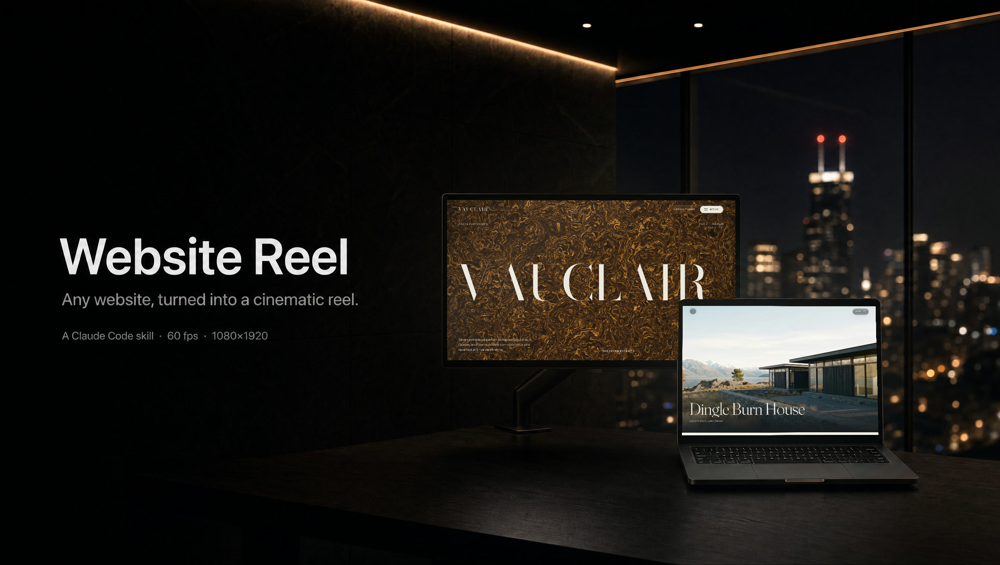
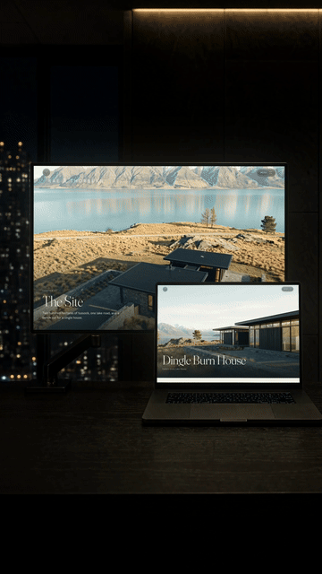
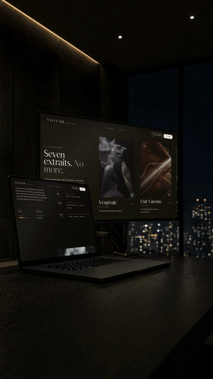
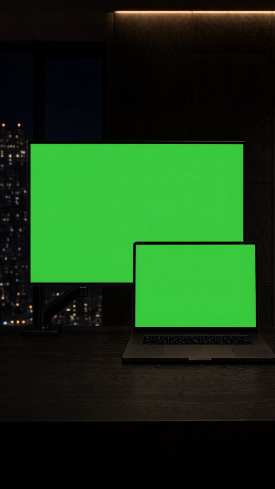
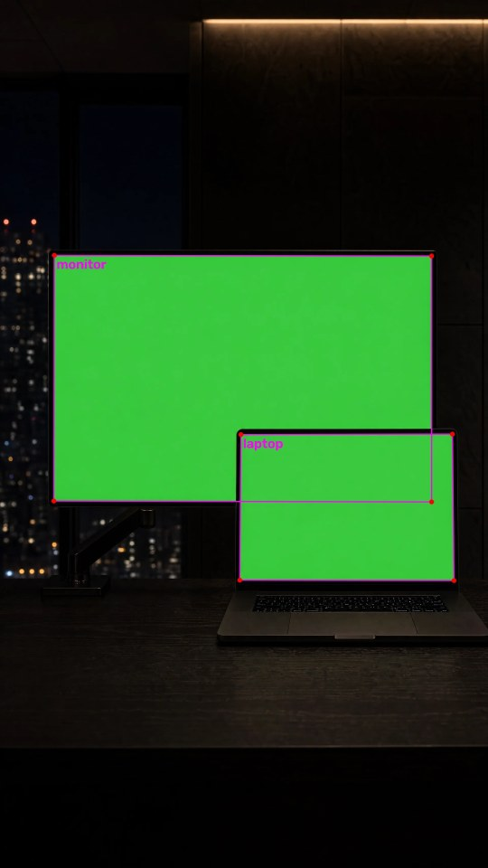
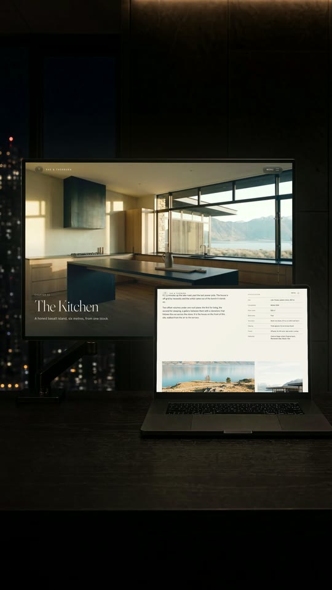
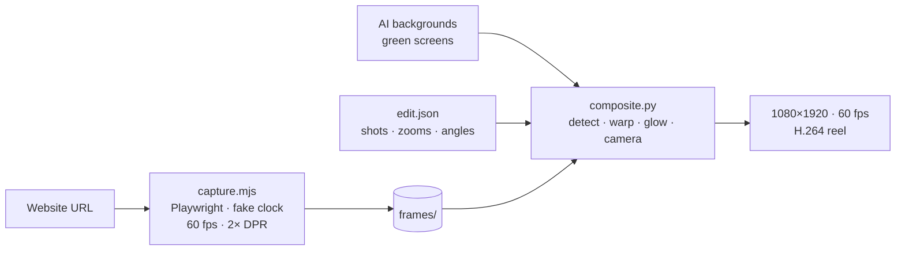

<div align="center">



<sub>The banner is made by the tool itself: an AI plate (<code>docs/media/banner-plate.webp</code>) with two real sites composited onto its screens via <code>composite.py --native</code>.</sub>

<br><br>

**Turn any website into a cinematic 9:16 reel: recorded frame by frame, composited into an AI-generated room.**

Playwright records the live site at 60 fps with a controlled clock, OpenCV finds the green screens in your AI background and drops the site in with real perspective, and a two-angle edit renders a high-bitrate 1080×1920 MP4 that's ready for Instagram. It ships as a Claude Code skill: say *"make a reel for https://…"* and Claude runs the whole pipeline.


<table>
  <tr>
    <td></td>
    <td></td>
  </tr>
  <tr>
    <td align="center"><sub><b>Rae & Thorburn</b> · two camera angles, scroll-driven drone hero</sub></td>
    <td align="center"><sub><b>Vauclair</b> · WebGL hero, pinned product carousel</sub></td>
  </tr>
</table>

<sub>GIF previews are downsampled; the real renders are 1080×1920 at 60 fps. Both sites are fictional showcase brands.</sub>

</div>

---

## Why it looks real

- **It records the site, not a screen.** Every frame is a 2× retina screenshot taken while the browser's clock is paused. JavaScript time, CSS/WAAPI animations and `<video>` are all stepped to the same virtual timeline, so shaders, reveal animations and scroll-driven heroes play at true speed with no dropped frames.
- **It finds the screens by itself.** Chroma-green detection with sub-pixel line fitting. When the laptop covers a corner of the monitor, the hidden corner is reconstructed from the visible edges (±2 px in tests).
- **It composites like a camera.** Perspective warp, lifted LCD blacks, a faint glass sheen, bezel despill, and light from the screens that spills onto the desk and keys, changing color with what's on screen.
- **Cuts never lose sync.** Every camera angle reads the same frame index, so on both sides of a cut the site sits at exactly the same scroll position.
- **The camera moves smoothly.** Push-ins render through a 2× sub-pixel intermediate, so slow zooms never jitter or shimmer on fine text.

## How it works

<table>
  <tr>
    <td></td>
    <td></td>
    <td></td>
  </tr>
  <tr>
    <td align="center"><sub><b>1 · Plate</b><br>AI-generated room, both screens chroma green</sub></td>
    <td align="center"><sub><b>2 · Detect</b><br>corners found, the one hidden behind the laptop reconstructed</sub></td>
    <td align="center"><sub><b>3 · Composite</b><br>the live site warped in, with screen light on the room</sub></td>
  </tr>
</table>



## Quick start

**Requirements:** macOS (tested on Apple Silicon), Node 18+, Python 3.10+, ffmpeg.

```bash
git clone https://github.com/MD-Stellr/website-reel.git ~/reel-maker
cd ~/reel-maker
npm install && npx playwright install chromium
python3 -m venv .venv && .venv/bin/pip install opencv-python-headless numpy
brew install ffmpeg                                              # if you don't have it

# install the Claude Code skill
mkdir -p ~/.claude/skills && ln -s ~/reel-maker/skills/website-reel ~/.claude/skills/website-reel
```

### With Claude Code

Open Claude Code anywhere and ask:

> make a reel for https://your-site.com

The skill inspects the site (pinned sections, scroll-driven heroes, where the text sits), measures your screens to pick the recording size, plans a continuous scroll, captures both screens, checks the frames for stalls, renders stills at every cut for you to review, then renders and reports the final reel. It also writes image prompts for new rooms and camera angles, and turns feedback like "cuts are too fast" into the right change.

### By hand

```bash
# 1 · record both screens (~1 min each)
node capture.mjs configs/rae-monitor.json &
node capture.mjs configs/rae-laptop.json &
wait

# 2 · check a few frames and a scroll-driven hero
tools/sheet.sh frames/rae-monitor debug/monitor-sheet.jpg 30 300 600 900
.venv/bin/python tools/check_stutter.py frames/rae-monitor 0 560

# 3 · preview frames around the cuts, then render (~4 min for 18 s)
.venv/bin/python composite.py --edit configs/rae-edit.json \
  --monitor frames/rae-monitor --laptop frames/rae-laptop --out output/reel.mp4 --still 683 684
.venv/bin/python composite.py --edit configs/rae-edit.json \
  --monitor frames/rae-monitor --laptop frames/rae-laptop --out output/reel.mp4
```

## Make your own room

Any 9:16 image with two flat chroma-green screens works: a monitor and a laptop, one can overlap the other. What makes an image usable:

- set **9:16 in the generator's UI** (models ignore it in the prompt text), at the highest resolution
- both screens **flat green, edge to edge**, with no UI, glare or reflections
- a **dark bezel between the two green areas** where they overlap
- no desk props, and no green light spilling onto the desk

Check any new image in one command. The magenta quads in `debug/detect-A.jpg` should sit exactly on both screens:

```bash
.venv/bin/python composite.py --bg backgrounds/NEW.webp --monitor frames/rae-monitor --laptop frames/rae-laptop --detect-only
.venv/bin/python tools/screen_ratios.py backgrounds/NEW.webp     # screen shapes → capture viewport sizes
```

The full prompts for both included angles (a low three-quarter shot and a straight-on shot of the same room) are in [the playbook's appendix](docs/PLAYBOOK.md#appendix-a--prompts-that-produced-the-current-room).

## Configuration

<details>
<summary><b>Capture config</b> (<code>configs/*-monitor.json</code>, <code>*-laptop.json</code>)</summary>

```jsonc
{
  "url": "https://rae-thorburn.vercel.app/",
  "out": "frames/rae-monitor",
  "width": 1440, "height": 920,      // CSS viewport; match the screen's shape (tools/screen_ratios.py)
  "dpr": 2,                          // frames are 2880×1840
  "fps": 60,
  "duration": 18,                    // same for both screens
  "settleMs": 6000,                  // let preloaders finish
  "interp": "smooth",                // scroll never stops at keyframes; omit to ease to a stop at each
  "hideSelectors": [".pointer-events-none.fixed.z-\\[100\\]"],   // e.g. a custom cursor
  "keyframes": [[0, 0], [0.8, 250], [9.4, 3680], [11.2, 4560]]   // [seconds, scrollY]
}
```
</details>

<details>
<summary><b>Edit plan</b> (<code>configs/*-edit.json</code>)</summary>

```json
{
  "angles": { "A": "backgrounds/env1-flip.png", "B": "backgrounds/env1-angleB-flip.png" },
  "shots": [
    {"angle": "B", "until": 11.4, "zoom": [1.00, 1.08], "focus": "both"},
    {"angle": "A", "until": 15.0, "zoom": [1.02, 1.07], "focus": "both"},
    {"angle": "B",                "zoom": [1.06, 1.12], "focus": "both"}
  ]
}
```
`until` is the cut time in seconds (omit it on the last shot). `zoom` is the push-in for that shot. `focus` is `both`, `monitor` or `laptop`.
</details>

<details>
<summary><b>composite.py flags</b></summary>

| Flag | Default | Meaning |
|---|---|---|
| `--edit FILE` / `--bg IMG` | — | multi-angle edit, or one background as one continuous shot |
| `--monitor DIR`, `--laptop DIR` | required | frame folders (the upper green screen is the monitor) |
| `--out FILE` | `output/reel.mp4` | output path |
| `--fps` | 60 | capture and output frame rate |
| `--frames N` | all | render only the first N frames |
| `--glow` | 0.22 | screen light spilling onto the room |
| `--lift` | 0.025 | black-level lift on the screens |
| `--crf` | 10 | x264 quality (lower = higher bitrate) |
| `--ig30` | off | also write a motion-blurred 30 fps version |
| `--swap` | off | swap which recording goes on which screen |
| `--native` | off | keep the background's own size and shape (banners, landscape stills) instead of the 9:16 reel canvas |
| `--detect-only` | off | write detection overlays only |
| `--still N …` | — | write preview PNGs to `debug/` instead of a video |
</details>

## What's in the repo

| Path | |
|---|---|
| `skills/website-reel/SKILL.md` | the Claude Code skill: procedure, house style, feedback → fix table |
| `capture.mjs` | deterministic website recorder |
| `composite.py` | screen detection, compositing, camera, encoding |
| `tools/` | contact sheets, stutter check, screen-shape measurement |
| `inspect*.mjs` | site probes: sections, pinned parts, videos, page screenshots |
| `configs/` | the capture and edit configs behind both example reels |
| `backgrounds/` | the example room: angle A, angle B and mirrored versions |
| `docs/PLAYBOOK.md` | the full reference: every step, schema, lesson and gotcha |

## Good to know

- **Instagram's ceiling is 1080×1920 at 60 fps.** Rendering higher only makes a bigger file for Instagram to shrink. Add music in the Instagram app so it's licensed.
- **Don't pause inside scroll-driven heroes.** The footage freezes. Use `"interp": "smooth"` and slow the scroll down instead of stopping.
- **Keep the laptop off the site's text.** If a site puts headings where the laptop overlaps the monitor, use the mirrored backgrounds.
- **Frames are big:** about 1.2 GB per screen per 18 s. They're gitignored, and re-capturing takes about a minute.
- A site that scrubs a real `<video>` element on scroll needs a small recorder change; see [Known limitations](docs/PLAYBOOK.md#10-known-limitations--gotchas).
